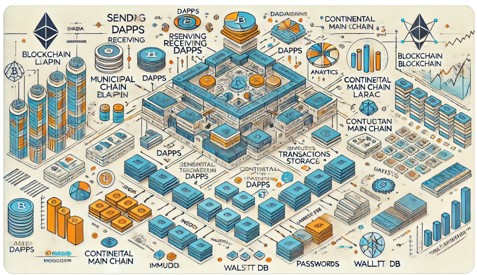

[フロントエンド]
  ├─ login.html
  │    ├─ ID/パスワード入力 → 認証API（/auth）
  │    └─ 認証成功 → dashboard.htmlへリダイレクト
  ├─ index.html
  │    ├─ トランザクション入力フォーム
  │    │    ├─ Sender, Receiver, Amount, Level, etc.
  │    │    └─ データ送信（/sendエンドポイント）
  │    └─ トランザクションステータス確認（/statusエンドポイント）
  └─ dashboard.html
       ├─ DAppsとの接続状況表示
       └─ 各Municipal Chainの状態モニタリング

    ↓

[APIゲートウェイ]
  ├─ 認証関連API
  │    ├─ /auth（ログイン認証）
  │    └─ /logout（ログアウト処理）
  ├─ トランザクションAPI
  │    ├─ /send（送信用データ受信）
  │    ├─ /receive（受信用データ受信）
  │    └─ /status（トランザクション進捗確認）
  └─ データ照会API
       ├─ /individuals（indivisuals.jsonからデータ取得）
       ├─ /municipalities（municipalities.jsonからデータ取得）
       └─ /analytics（分析結果提供）

    ↓

[DApps]
  ├─ sending_dapps
  │    ├─ トランザクション生成
  │    ├─ Proof of Place（送信者の位置情報検証）
  │    └─ Municipal Chainへの送信（HTTPリクエスト）
  ├─ receiving_dapps
  │    ├─ 受信者確認（Proof of Place）
  │    ├─ Municipal Chainからのトランザクション受信
  │    └─ 確認ボタン押下 → Municipal Chainへ応答送信
  └─ analytics_dapps
       ├─ MongoDBからデータ抽出
       ├─ トランザクション統計処理
       └─ 可視化用データ生成

    ↓

[Municipal Chain]
  ├─ トランザクション管理
  │    ├─ 送信データ受信 → DPoSによる承認処理
  │    ├─ 受信データ保持（pendingリスト）
  │    └─ gossipアルゴリズムによるデータ分散
  ├─ Proof of History（トランザクションの履歴確認）
  └─ Continental Main Chainへの送信

    ↓

[Continental Main Chain]
  ├─ 各Municipal Chainからのデータ統合
  ├─ トランザクションの承認と保留
  │    ├─ 受信者の確認が取れるまで保留
  │    └─ 保留リストの定期的クリーンアップ
  └─ Global Main Chainへの送信

    ↓

[Global Main Chain]
  ├─ 全Continental Main Chainからのデータ統合
  ├─ 世界規模のデータ分析
  └─ 永久保存データの生成

    ↓

[データストレージ]
  ├─ mongoDB
  │    ├─ トランザクション保留リスト（Municipal/Continental）
  │    └─ 分析用データの一時保存
  ├─ immuDB
  │    ├─ ブロックチェーンデータの永久保存
  │    └─ 変更不可能な履歴管理
  └─ walletDB
       ├─ 各ユーザーのウォレット残高管理
       ├─ トランザクション履歴
       └─ セキュアな暗号化通信

